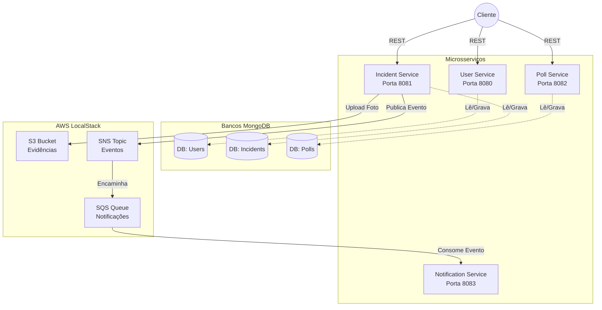

# 🏢 CommunityHub

[](https://www.oracle.com/java/)
[](https://spring.io/projects/spring-boot)
[](https://www.mongodb.com/)
[](https://www.docker.com/)
[](https://localstack.cloud/)
[](https://github.com/features/actions)
[](LICENSE)

Uma plataforma digital criada para simplificar a vida em condomínios. O CommunityHub centraliza a comunicação entre moradores e a administração, desde o registro de ocorrências até votações em assembleias virtuais.

## 💡 Sobre o projeto

Viver em condomínio muitas vezes significa lidar com murais de papel, grupos de WhatsApp caóticos e perda de informações importantes. O CommunityHub nasceu para resolver essa dor. 

Ele é um sistema focado em facilitar a gestão colaborativa de condomínios residenciais. Moradores podem reportar vazamentos, votar em melhorias para o prédio e receber avisos oficiais, tudo em um único lugar. Para garantir que o sistema não saia do ar se muitas pessoas acessarem ao mesmo tempo, ele foi construído dividindo as responsabilidades em pequenos "miniaplicativos" (microsserviços) que conversam entre si.

## ✨ Funcionalidades principais

- **Gestão de Identidade:** Cadastro seguro de moradores com senhas criptografadas e login via token (JWT).
- **Registro de Ocorrências:** Moradores podem reportar problemas (ex: goteira na garagem), anexar fotos como evidência e alertar a manutenção.
- **Enquetes e Votações:** Administração pode criar votações (ex: "Pintar a fachada de azul ou verde?"), garantindo que cada morador vote apenas uma vez.
- **Sistema de Notificações:** Emissão de alertas assíncronos baseados em eventos críticos.

## 🛠️ Stack Tecnológica

As ferramentas abaixo foram escolhidas com foco em escalabilidade e facilidade de manutenção:

- **Java 21 & Spring Boot 3.2:** Base sólida, madura e eficiente. O uso do Java 21 permite tirar proveito de recursos modernos da linguagem e excelente performance.
- **MongoDB:** Banco de dados NoSQL escolhido pela flexibilidade. Como cada serviço possui seu próprio domínio, o uso de documentos se ajusta perfeitamente sem a necessidade de esquemas rígidos.
- **AWS LocalStack (S3, SNS e SQS):** Usado para emular serviços em nuvem localmente. O S3 guarda as imagens, o SNS distribui os eventos do sistema e o SQS gerencia a fila de envios de e-mail/push.
- **Spring Security & JWT:** Garante que a API seja *stateless*, facilitando a escalabilidade horizontal (os servidores não precisam guardar a sessão de quem está logado).
- **Docker & Docker Compose:** Permite que qualquer desenvolvedor suba a infraestrutura inteira com apenas um comando, padronizando os ambientes.

## 🧩 Arquitetura

O ecossistema é formado por 4 microsserviços independentes. Eles não compartilham o mesmo banco de dados (evitando alto acoplamento) e se comunicam de forma assíncrona via mensageria para rotinas em background.



## 🧠 Decisões Técnicas Relevantes

- **Clean Architecture:** Separamos a lógica de negócios (Domínio) dos detalhes técnicos (Controladores, Repositórios). Isso nos permitiu focar no comportamento do sistema sem ficar reféns do framework.
- **Comunicação Assíncrona (SQS/SNS):** Se o serviço de notificação cair, a fila do AWS SQS preserva as mensagens intactas. Quando o serviço voltar, processa tudo sem perda de dados.
- **Docker Multi-stage Build:** Os contêineres foram compilados em etapas. A imagem final roda apenas a JRE (que é muito mais leve e segura), deixando as ferramentas de compilação pesadas para trás.
- **Strategy Pattern nas Notificações:** Em vez de `if/else` poluindo o código para checar se o aviso é por E-mail ou Push, utilizamos o Padrão Strategy para tornar o sistema facilmente expansível.

## 🚀 Como rodar o projeto

Todo o ambiente está containerizado. Você **não precisa** ter Java, Maven ou MongoDB instalados localmente, apenas o [Docker Desktop](https://www.docker.com/products/docker-desktop/).

1. Clone o repositório:
   ```bash
   git clone https://github.com/seu-usuario/CommunityHub.git
   cd CommunityHub
   ```

2. Construa e suba toda a infraestrutura em background:
   ```bash
   docker compose up -d --build
   ```

3. (Opcional) Verifique se os contêineres subiram com sucesso:
   ```bash
   docker compose ps
   ```

### Documentação das APIs (Swagger)

A interface do Swagger está ativada para você testar os endpoints direto pelo navegador de forma visual:

- **User Service:** [http://localhost:8080/swagger-ui/index.html](http://localhost:8080/swagger-ui/index.html)
- **Incident Service:** [http://localhost:8081/swagger-ui/index.html](http://localhost:8081/swagger-ui/index.html)
- **Poll Service:** [http://localhost:8082/swagger-ui/index.html](http://localhost:8082/swagger-ui/index.html)

> **Dica de Segurança:** Para acessar as rotas bloqueadas no Swagger, faça uma requisição POST na rota `/api/users/login` (no User Service). Copie o JWT fornecido na resposta, clique no botão **Authorize** (no topo da página) e cole o token.

## 🛣️ Status e Roadmap

O projeto conclui a fundação inicial do Back-end.
- [x] Autenticação e Segurança (JWT)
- [x] Mensageria e Uploads simulando AWS
- [x] Containerização com Docker
- [x] Pipeline de Integração Contínua (CI) com GitHub Actions
- [ ] Criação de um API Gateway para unificar as chamadas em uma única porta
- [ ] Desenvolvimento de um aplicativo Frontend (React ou Flutter)

## 🤝 Como contribuir

Sinta-se livre para contribuir com melhorias:
1. Faça um Fork do projeto.
2. Crie uma branch para a sua feature (`git checkout -b feature/nova-feature`).
3. Faça o commit das suas alterações (`git commit -m 'feat: implementa nova funcionalidade'`).
4. Faça o push para a branch (`git push origin feature/nova-feature`).
5. Abra um Pull Request.

## 📜 Licença

Este projeto é de código aberto e está disponível sob a licença [CC0 1.0 Universal (Domínio Público)](LICENSE).

## ✉️ Contato

Criado por Lucas. Se quiser bater um papo sobre arquitetura de software, Clean Code, ou Java, me encontre no [LinkedIn](linkedin.com/in/lucas-vinícius-4b8760241).
