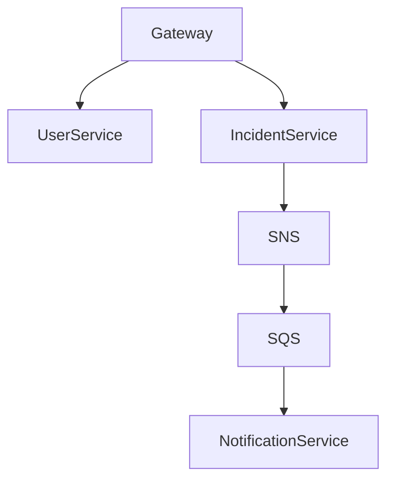

Se o objetivo é **chamar atenção de recrutadores**, não faça mais um CRUD de tarefas, biblioteca ou e-commerce. Esses projetos já estão saturados.

Você precisa de algo que demonstre exatamente o que essa vaga procura:

✅ Spring Boot
✅ Arquitetura de Microsserviços
✅ MongoDB
✅ AWS (ou simulação local dos serviços)
✅ Testes
✅ Design Patterns
✅ CI/CD
✅ Boas práticas de engenharia

E que seja possível terminar um **MVP em 1 semana**.

---

# Projeto: CommunityHub

### Sistema de gestão de comunicados e ocorrências para condomínios

Inspirado no domínio da própria TownSq.

Imagine um backend onde:

* Moradores criam ocorrências
* Síndicos recebem notificações
* Comunicados são publicados
* Moradores podem votar em enquetes
* Sistema gera eventos e notificações assíncronas

---

# O que impressiona?

Porque demonstra problemas reais:

* Gestão de usuários
* Comunicação
* Eventos
* Filas
* Notificações
* Microsserviços

Tudo isso é extremamente comum em empresas SaaS.

---

# Arquitetura

```text
API Gateway
    |
    ├── User Service
    ├── Incident Service
    ├── Notification Service
    └── Poll Service
```

---

# Stack

## Backend

* Java 21
* Spring Boot 3
* Spring Data MongoDB
* Spring Validation
* Spring Security + JWT

---

## Arquitetura

* Clean Architecture
* DDD Lite
* Hexagonal Architecture

Estrutura:

```text
src/main/java

├── domain
│
├── application
│
├── infrastructure
│
├── presentation
│
└── config
```

Essa estrutura chama muita atenção atualmente.

---

# Microsserviços

## User Service

Responsável por:

* Cadastro
* Login
* JWT

Coleção:

```json
{
  "_id": "...",
  "name": "Carlos",
  "email": "..."
}
```

---

## Incident Service

Ocorrências.

Exemplo:

```json
{
  "title": "Portão quebrado",
  "description": "...",
  "status": "OPEN"
}
```

---

## Poll Service

Enquetes.

```json
{
  "title": "Trocar pintura?",
  "options": [...]
}
```

---

## Notification Service

Recebe eventos.

Exemplo:

```json
{
  "event": "INCIDENT_CREATED",
  "userId": "123"
}
```

---

# AWS que você pode mostrar

Mesmo sem gastar dinheiro.

## S3

Anexos da ocorrência.

```text
foto-portao.jpg
```

---

## SNS

Publicação de eventos.

```text
INCIDENT_CREATED
```

---

## SQS

Fila de notificações.

```text
notification-queue
```

---

## Lambda

Processamento de notificações.

```text
Nova ocorrência criada
```

No README você pode colocar um diagrama mostrando a integração.

---

# Design Patterns

Aplicar alguns relevantes:

### Strategy

Notificações

```java
EmailNotificationStrategy
PushNotificationStrategy
```

---

### Factory

Criação de eventos.

```java
EventFactory
```

---

### Observer

Eventos internos.

```java
IncidentCreatedEvent
```

---

# Testes

Muito importante.

Faça:

## Unitários

JUnit 5

```java
UserServiceTest
```

---

## Integração

```java
@SpringBootTest
```

---

## Testcontainers

MongoDB real em container.

Isso impressiona bastante recrutadores.

---

# DevOps

Docker

```yaml
docker-compose.yml
```

com:

```text
Mongo
User Service
Incident Service
Notification Service
Poll Service
```

---

GitHub Actions

Pipeline:

```yaml
- Build
- Test
- Sonar
- Docker Build
```

---

# README Profissional

Inclua:

## Arquitetura

Diagrama Mermaid



---

## Decisões Técnicas

Explique:

* Por que MongoDB
* Por que Clean Architecture
* Por que eventos assíncronos

Isso é o que recrutadores gostam de ler.

---

# Cronograma de 7 dias

### Dia 1

Setup

* Arquitetura
* Docker
* Mongo

---

### Dia 2

User Service

* Login
* JWT

---

### Dia 3

Incident Service

* CRUD
* Testes

---

### Dia 4

Poll Service

* CRUD
* Votação

---

### Dia 5

Notification Service

* Eventos
* Strategy Pattern

---

### Dia 6

GitHub Actions
Docker Compose

---

### Dia 7

README
Diagramas
Documentação

